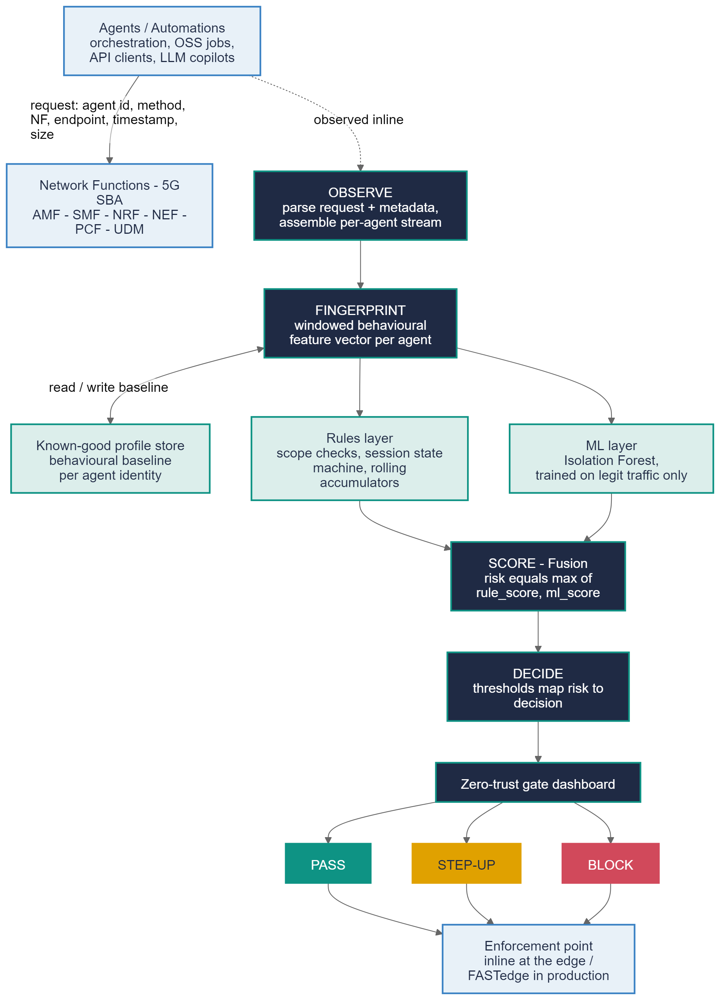

# AEGIS - Zero-Trust Identity for AI Agents on the Network

**5G Academy 2026 - Fastweb + Vodafone - Team 4**
Topic 2 - Security on Network - Assigned by the Committee on 27 July 2026.

**Live project page:** (https://fauzan111.github.io/AEGIS/#gate1)
**Live dashboard:** https://aegis5gacademy.streamlit.app/

## The idea in one line

As AI agents and automations increasingly act on 5G network control services, a valid credential alone can't prove an agent is what it claims to be. AEGIS builds a **behavioural fingerprint** of each legitimate agent and continuously scores every request against it: a **zero-trust gate for machine identities**.

## The problem

Orchestration tools, closed-loop automation, and AI copilots now call 5G Network Functions directly over the network's control-plane APIs (the Service-Based Interface). A stolen token or a compromised automation still passes normal authentication, the credential is valid, but the actor behind it isn't. Classic authentication cannot answer "is this really our agent, behaving the way it always does?" AEGIS answers that question, aligned with NIST SP 800-207 zero-trust principles: never trust, always verify, verify continuously.

## Project progress

### Gate 1 - Technologies, Planning & Feasibility (complete)

Established the technology approach (behavioural fingerprinting plus rules and ML anomaly detection on the 5G Service-Based Architecture), the project schedule, technical feasibility, and the economic and business case for a zero-trust gate on machine identities.

Full Gate 1 materials: `slides/GATE-1/` (official deck) and `docs/GATE-1/` (prototype write-up).

### Gate 2 - Technical Solution & Architecture (complete)

Delivered the full technical solution: a concrete system architecture, a working end-to-end implementation, and a complete numerical performance analysis, benchmarked against a **named, reimplemented state-of-the-art baseline** rather than literature citations.

- **Architecture:** an OBSERVE to FINGERPRINT to SCORE to DECIDE zero-trust gate, covering all seven modelled threats (identity spoofing, compromised agents, reconnaissance, volumetric abuse, slow exfiltration, sequence anomalies, and scope creep).

  

- **Results, on a held-out test set of about 11,365 request windows:** ROC-AUC 0.965, recall 90.7%, false-positive rate 1.4%, with detection rate intentionally uneven across threats (76 to 100 percent) rather than a uniform, implausible 100 percent everywhere, matching how real detection systems perform in the published research.
- **Benchmarked head-to-head against Statistical Process Control (SPC)**, the classic z-score control-chart baseline, reimplemented and run on the identical train/test split as AEGIS: 0.944 ROC-AUC / 63.4% recall for SPC versus 0.965 / 90.7% for AEGIS, a statistically significant improvement (paired bootstrap, p = 0.015).
- **A rigorous, checkable threshold justification:** the chosen decision threshold is shown to be Pareto-efficient and within 0.2 points of FPR of the empirical Neyman-Pearson-achievable frontier, consistent with a stated cost ratio, rather than an unqualified "optimal" claim.
- **A live dashboard:** real-time risk scoring, a Live Attack Injection panel that runs the real detection pipeline live against any of the seven threat scenarios, a Before AEGIS / With AEGIS comparison, an animated network-topology view, a live-replay mode, and an incident inspector that explains why each decision was made in plain language.
- **Additional statistical evidence** (`reports/GATE-2/`): bootstrap confidence intervals, cross-validated threshold stability, a temporal train/test split robustness check, a concept-drift check, and an adversarial evasion stress test.

Full Gate 2 report: `docs/GATE-2/GATE-2.md` (also available as a Word document in `slides/GATE-2/`).

### Gate 3 - Proof of Concept (in progress)

Closing the detection gaps flagged at Gate 2, extending validation to a real 5G core instead of only synthetic traffic, and widening the threat/agent catalogue to stress-test generalisation - the technical work here is complete; the final demo video and Gate 3 report/deck are still in progress.

- **Hardened the two weakest threats.** Added a per-target-ID cardinality feature (rolling distinct-subscriber-ID tracking, both a new rule and a new ML feature) since the in-scope endpoint universe alone was too small to separate legitimate diversity from actual reconnaissance. Recon detection 80% -> 95%, exfiltration 76% -> 80%, bootstrap-validated.
- **Validated against a real 5G core, not just synthetic traffic.** Stood up an actual Open5GS 5G SA core plus a UERANSIM UE (kept as separate infrastructure, not vendored into this repo), got a genuine registration and PDU session established, and captured real HTTP/2 SBI signalling. Confirmed the synthetic generator's endpoint-naming convention matches real captured 3GPP service calls almost exactly, then went further: ran real attack-like traffic through AEGIS's actual, unmodified detection code and confirmed it correctly flags real behaviour, not just synthetic behaviour. Full runbook and results: `docs/GATE-3/real-traffic-capture.md`.
- **Widened the agent and attack catalogue** from 5 agents/7 threats to 7 agents/10 threat variants, including two deliberately extreme agent profiles (one with legitimate access to every Network Function, one restricted to a single NF) and three harder attack variants. Found and fixed a real bug along the way: one new attack variant scored 0% detected, not because the behaviour was undetectable but because of how the attack's timing diluted it into a busy agent's own concurrent legitimate traffic - fixing the attack's construction (not the detector) took it to 100%.
- **Grounded the NF endpoint catalogue in real 3GPP specifications** (TS 29.518, 29.502, 29.510, 29.507/512/514, 29.503, 29.522), widening each Network Function's modelled surface from 2-3 endpoints to a more representative slice of what it actually exposes.
- **Mapped the seven threats against MITRE FiGHT and GSMA/ENISA's public 5G security guidance**, with verified citations. Five of seven threats match named, externally recognised attacker techniques; two have no match in either framework, stated plainly as AEGIS's own behavioural contributions rather than forced into a fit. Full mapping: `docs/GATE-3/threat-model-external-mapping.md`.

Full-catalogue results after all of the above: ROC-AUC 0.979, recall 91.6%, false-positive rate 1.44% (within the ~1.5% design budget), across 7 agents and 10 attack variants.

Still to come: the final demo video and the Gate 3 report/deck.

## Team

Fauzan Ejaz (Captain), Llagami Tedi

## Where to find things

- `docs/GATE-1/`, `docs/GATE-2/`, `docs/GATE-3/` - Gate reports, presentation scripts, threat model, architecture documentation, the real-traffic-capture runbook, and the FiGHT/GSMA threat-model mapping
- `slides/GATE-1/`, `slides/GATE-2/` - Gate presentation decks and official report submissions
- `reports/`, `reports/GATE-1/`, `reports/GATE-2/`, `reports/GATE-3/` - evaluation charts, metrics, the architecture diagram, the Gate 2 statistical evidence suite, and the real-traffic capture results
- `src/` - source code for the traffic generator, detector, dashboard, and the real-traffic capture/validation scripts
- `data/` - the synthetic dataset used for evaluation
