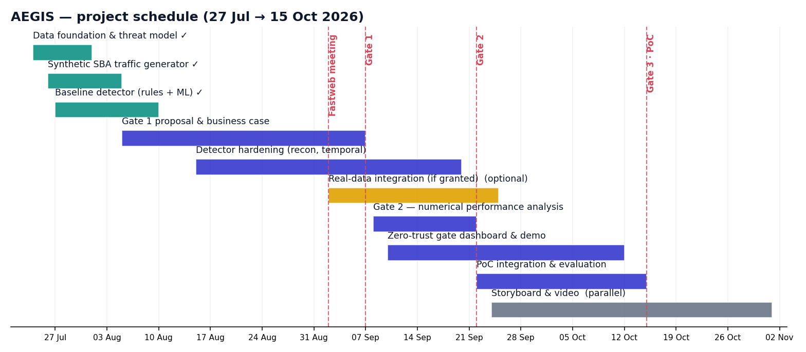
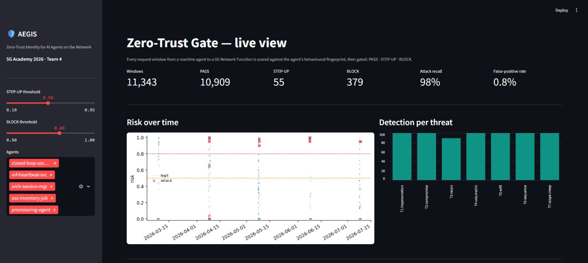
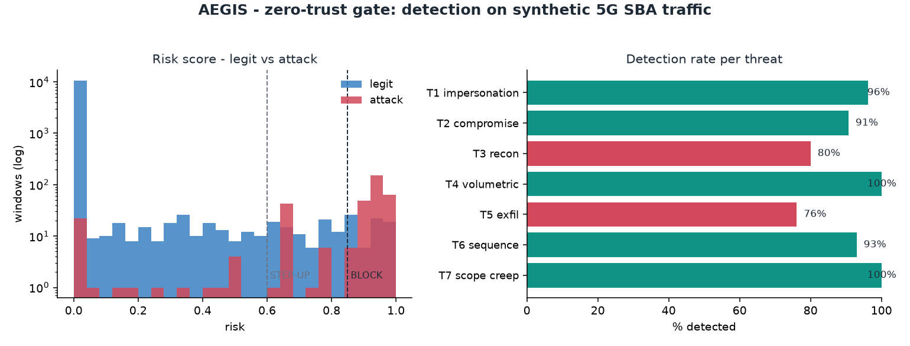
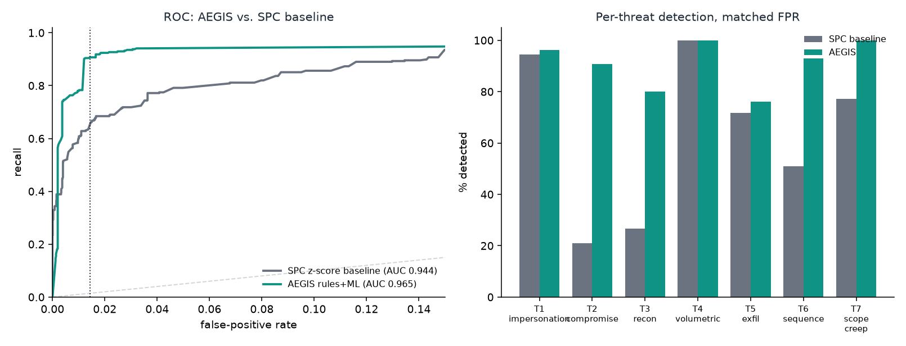
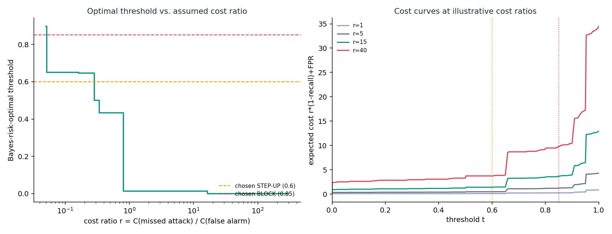

# AEGIS - Zero-Trust Identity for AI Agents on the Network

**5G Academy 2026 - Fastweb + Vodafone - Team 4**
Topic 2 - Security on Network - Assigned by the Committee on 27 July 2026.

**Live project page:** (https://fauzan111.github.io/AEGIS/#gate1)
**Live dashboard:** https://aegis5gacademy.streamlit.app/

## The idea in one line

As AI agents and automations increasingly act on 5G network control services, a valid credential alone can't prove an agent is what it claims to be. AEGIS builds a **behavioural fingerprint** of each legitimate agent and continuously scores every request against it: a **zero-trust gate for machine identities**.

## The problem

Orchestration tools, closed-loop automation, and AI copilots now call 5G Network Functions directly over the network's control-plane APIs (the Service-Based Interface). A stolen token or a compromised automation still passes normal authentication, the credential is valid, but the actor behind it isn't. Classic authentication cannot answer "is this really our agent, behaving the way it always does?" AEGIS answers that question, aligned with NIST SP 800-207 zero-trust principles: never trust, always verify, verify continuously.

## Project progress

### Gate 1 - Technologies, Planning & Feasibility (complete)

Established the technology approach (behavioural fingerprinting plus rules and ML anomaly detection on the 5G Service-Based Architecture), the project schedule, technical feasibility, and the economic and business case for a zero-trust gate on machine identities.

*Project schedule from proposal to the final Proof of Concept - technology approach, feasibility analysis, and economic case were validated before any code was written, de-risking the build that followed.*

Full Gate 1 materials: `slides/GATE-1/` (official deck) and `docs/GATE-1/` (prototype write-up).

### Gate 2 - Technical Solution & Architecture (complete)

Delivered the full technical solution: a concrete system architecture, a working end-to-end implementation, a complete numerical performance analysis benchmarked against a **named, reimplemented state-of-the-art baseline**, and a statistically rigorous justification for the chosen decision thresholds.

**Architecture** - an OBSERVE to FINGERPRINT to SCORE to DECIDE zero-trust gate, covering all seven modelled threats (identity spoofing, compromised agents, reconnaissance, volumetric abuse, slow exfiltration, sequence anomalies, and scope creep).

**The live dashboard** - real-time risk scoring, a **Live Attack Injection** panel that runs the actual generator and the actual rules+ML pipeline live against any of the seven threat scenarios (not a scripted replay), a **Before AEGIS / With AEGIS** side-by-side comparison that shows the same attack sailing straight through a credential-only check while AEGIS catches it, an animated network-topology view, a live-replay mode, and an incident inspector that explains why each decision was made in plain language.

**Results, on a held-out test set of about 11,365 request windows:** ROC-AUC 0.965, recall 90.7%, false-positive rate 1.4%, with detection rate intentionally uneven across threats (76 to 100 percent) rather than a uniform, implausible 100 percent everywhere, matching how real detection systems perform in the published research.

**Benchmarked against a named, reimplemented baseline, not a citation.** "State of the art" can mean anything unless you name a specific system, describe how it works, and test it on your own data. We implemented **Statistical Process Control (SPC)**, a z-score control-chart detector, the classic baseline this kind of behavioural monitoring descends from, and ran it on the identical train/test split AEGIS is evaluated on: 0.944 ROC-AUC / 63.4% recall for SPC versus 0.965 / 90.7% for AEGIS, a statistically significant gap (paired bootstrap, p = 0.015).

**A rigorous, checkable threshold justification, not just a picked number.** A threshold can only rigorously be called optimal with respect to a stated objective. Rather than an unqualified claim, we show our chosen STEP-UP threshold is Pareto-efficient (no single alternative threshold beats it on both recall and false-positive rate), sits within 0.2 percentage points of FPR of the empirical Neyman-Pearson-achievable frontier, and is consistent with a stated, sweepable cost ratio.

**Additional statistical evidence** (`reports/GATE-2/`): bootstrap confidence intervals on every headline metric, cross-validated threshold stability, a temporal (chronological, not random) train/test split robustness check, a concept-drift/stationarity check across the simulated week, and an adversarial evasion stress test showing where the current detector's blind spot is and what fixes it.

Full Gate 2 report: `docs/GATE-2/GATE-2.md` (also available as a Word document in `slides/GATE-2/`).

### Next: Gate 3 - Proof of Concept (Final)

The final working Proof of Concept demonstration and video, closing the remaining detection gaps on the hardest threats, and extending the pipeline to real network traffic as the next validation step - the architecture is already designed to take this in without rework.

## Team

Fauzan Ejaz (Captain), Adithya Zacharia Valavi, Ghazanfar Anees Siddiqui, Llagami Tedi

## Where to find things

- `docs/GATE-1/`, `docs/GATE-2/` - Gate reports, presentation scripts, threat model, and architecture documentation
- `slides/GATE-1/`, `slides/GATE-2/` - Gate presentation decks and official report submissions
- `reports/`, `reports/GATE-1/`, `reports/GATE-2/` - evaluation charts, metrics, the architecture diagram, and the Gate 2 statistical evidence suite
- `src/` - source code for the traffic generator, detector, and dashboard
- `data/` - the synthetic dataset used for evaluation
